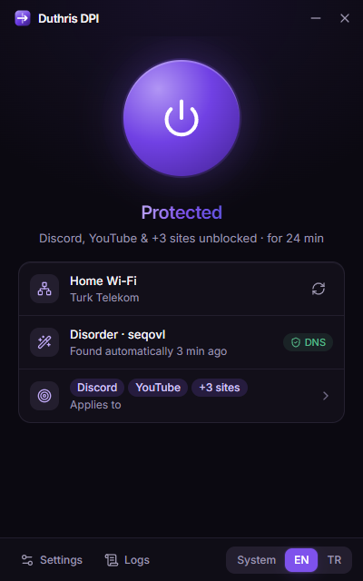
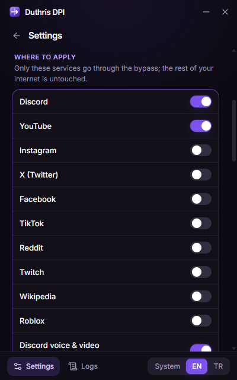
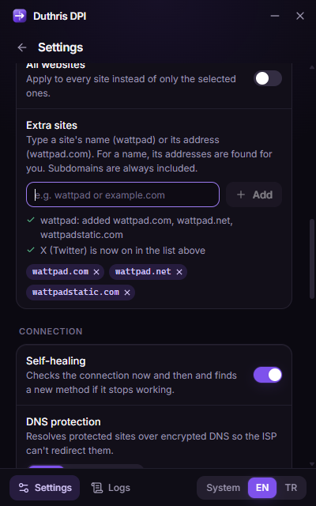

<div align="center">


<br>

[](https://github.com/Duthris/duthris-dpi/releases/latest)
[](https://github.com/Duthris/duthris-dpi/releases)
[](#-install)
[](LICENSE)
[](https://github.com/Duthris/duthris-dpi/actions/workflows/ci.yml)

**English** · [Türkçe](README.tr.md)

**One-click DPI bypass for Windows.** Press the button: it finds what works on your network by itself,<br>
remembers it, and keeps it working from the tray. Only the services you pick are touched.

<a href="https://github.com/Duthris/duthris-dpi/releases/latest"></a>

</div>

<br>

<table align="center">
  <tr>
    <td align="center"><br><sub><b>One button</b>, live status</sub></td>
    <td align="center"><br><sub><b>Pick services</b>, the rest stays untouched</sub></td>
    <td align="center"><br><sub><b>Type a name</b>, addresses are found for you</sub></td>
  </tr>
</table>

## ✨ Why another one

Existing tools work, but ask a lot of the user: picking the right `.cmd` for your ISP, keeping a console window open, setting DNS by hand, installing a proxy redirector. Duthris DPI does those steps for you.

| | |
| --- | --- |
| 🔍 **Finds the method by itself** | Recognises your ISP, tries the methods known to work there first and verifies each one with real HTTPS requests before choosing it. |
| 🧠 **Remembers every network** | Home Wi-Fi, phone hotspot and office get their own settings; switching between them is instant. |
| 🩹 **Repairs itself** | Checks the connection now and then. If a method stops working, or your DNS starts lying, it fixes itself. |
| 🎯 **Only touches what you choose** | By default only Discord goes through the bypass. Turn on YouTube, Instagram, X, TikTok, Reddit, Twitch, Wikipedia, Roblox… or type any site. |
| 🛡️ **Fixes DNS without changing it** | Only the protected sites are resolved over encrypted DNS (DoH); everything else keeps your DNS servers. The original settings come back on exit, and after a crash. |
| 🧹 **Clears conflicts** | Detects GoodbyeDPI, zapret or ByeDPI running in the background and offers to stop them. |
| 🔄 **Updates itself** | New versions download in the background and install on the next restart. |
| 🌍 **English & Turkish** | Follows your Windows language, or pick one. |

## 📥 Install

1. Download from the [latest release](https://github.com/Duthris/duthris-dpi/releases/latest):
   - **`Duthris-DPI-Setup-x.y.z.exe`**: installer. Recommended; it **updates itself**.
   - **`Duthris-DPI-Portable-x.y.z.exe`**: single file, nothing to install. It tells you when a new version is out, but you download it yourself.
2. Run it and accept the administrator prompt. Filtering network traffic needs it.
3. Press the big button. The first time on a network it takes a few seconds to find the right method.
4. If Discord was already open, restart it (the app offers a button for that).

> [!NOTE]
> The executables are not code-signed yet, so Windows SmartScreen may say *"Windows protected your PC"*. Click **More info → Run anyway**. Every release is built from this repository by [GitHub Actions](https://github.com/Duthris/duthris-dpi/actions/workflows/release.yml), and the engine is downloaded from the upstream zapret release with a pinned checksum.

> [!WARNING]
> **Kaspersky** blocks the WinDivert driver this app relies on, even while disabled; the app warns you when it is installed. Other antiviruses may flag `winws.exe` or `WinDivert64.sys`, as with every DPI tool; add an exception for the install folder if that happens.

<div align="center">
  
  <br><sub>Closing the window keeps it running in the tray; the first few times it says so.</sub>
</div>

## ⚙️ How it works

| Part | What it does |
| --- | --- |
| **Engine** | [zapret](https://github.com/bol-van/zapret) `winws` on top of [WinDivert](https://github.com/basil00/WinDivert). Only connections to the selected sites are modified; the rest pass through untouched. |
| **Scanner** | Resolves the test hosts over DoH, checks whether your DNS servers lie (IPv4 *and* IPv6, router included), measures a baseline, then tries the methods in the order most likely to work for your ISP. |
| **Smart DNS** | A local forwarder on `127.0.0.1:53`: protected names go over DoH, everything else to your original servers. Turned on only when it's needed. |
| **Health check** | Every 10 minutes: are the services still reachable, has the DNS started lying? If not, it looks for a new method on its own. |

> Per-application filtering ("only `Discord.exe`") isn't possible at the packet level the engine works on, so services are defined by the domains they use. That's also what keeps a browser's other tabs out of the bypass.

## ❓ FAQ

<details>
<summary><b>Discord is stuck on "Checking for updates…"</b></summary>

Restart Discord after the app says **Protected**; a Discord that was open before keeps its blocked connections. If it still hangs, open **Settings → Tools → Copy diagnostics** and open an issue with it.
</details>

<details>
<summary><b>Does it slow down my internet or games?</b></summary>

No. It isn't a VPN: traffic still goes straight to the site. Only the first packets of connections to the selected services are rearranged; other traffic passes through unchanged.
</details>

<details>
<summary><b>It says "None of the built-in methods got through"</b></summary>

Try **Settings → Advanced → Full scan**. If that doesn't help either, open an issue with the diagnostics, including your ISP, so a method can be added.
</details>

<details>
<summary><b>How do I add a site that isn't in the list?</b></summary>

**Settings → Where to apply → Extra sites.** Type its name (`wattpad`) or its address (`wattpad.com`). For a name, its addresses (including CDNs for known sites) are found for you.
</details>

<details>
<summary><b>How do I remove it completely?</b></summary>

Quit from the tray icon (this restores DNS), then uninstall it from Windows Settings → Apps. The portable version leaves nothing behind except its settings in `%APPDATA%\Duthris DPI`.
</details>

## 🔒 Privacy

No accounts, no telemetry, no servers of our own. The app only talks to:

- the sites you selected, to test whether they're reachable;
- public DoH resolvers (Cloudflare `1.1.1.1`, Google `8.8.8.8`, Quad9 `9.9.9.9`) for the protected names;
- `ipinfo.io` to recognise your ISP (can be turned off: **Settings → Connection → Recognise my ISP**);
- GitHub, to check for updates.

## 🛠️ Development

Requires Windows 10/11 x64, Node.js 22+ and pnpm.

```sh
pnpm install
pnpm engine     # download + verify the zapret engine into resources/engine
pnpm dev        # Vite + Electron with hot reload (run from an elevated terminal)
pnpm verify     # typecheck + lint + build
pnpm package    # NSIS installer + portable exe in release/
```

Pushing a `v*` tag builds and publishes a release with GitHub Actions; installed copies pick it up through the auto-updater.

```
src/main       Electron main process: scanner, engine, DNS forwarder, tray, updater
src/renderer   React UI (Vite, Tailwind)
src/shared     Types, translations, services and strategies shared by both
scripts        Dev runner, engine download, icon generation
```

## 🙏 Credits

- [zapret](https://github.com/bol-van/zapret) by bol-van: the DPI bypass engine (MIT)
- [WinDivert](https://github.com/basil00/WinDivert) by basil00: packet capture driver (LGPL-3.0 / GPL-2.0)
- Cygwin runtime (LGPL-3.0)

Their licenses ship with the app in `resources/licenses` and the engine folder.

## ⚖️ Legal notice

> [!IMPORTANT]
> All legal responsibility arising from the use of this application lies with the person using it. The application was written and is maintained solely for educational and research purposes; using it under these terms or not is entirely the user's own choice. This project is shared on an open-source platform for the purposes of knowledge sharing and software development education.

## 📄 License

[MIT](LICENSE) © Duthris
