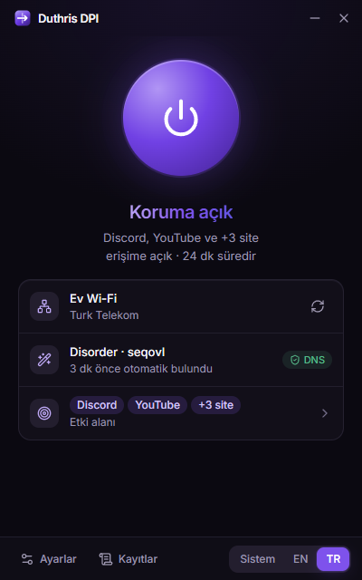
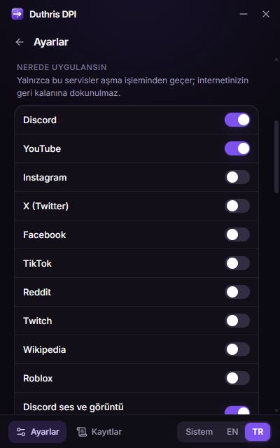
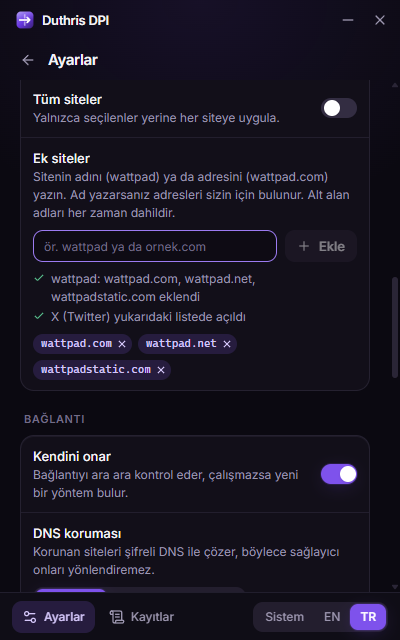
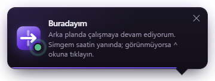

<div align="center">


<br>

[](https://github.com/Duthris/duthris-dpi/releases/latest)
[](https://github.com/Duthris/duthris-dpi/releases)
[](#-kurulum)
[](LICENSE)
[](https://github.com/Duthris/duthris-dpi/actions/workflows/ci.yml)

[English](README.md) · **Türkçe**

**Windows için tek tıkla DPI aşma aracı.** Düğmeye basın: ağınızda neyin çalıştığını kendisi bulur,<br>
hatırlar ve bildirim alanından çalışmaya devam eder. Yalnızca seçtiğiniz servislere dokunur.

<a href="https://github.com/Duthris/duthris-dpi/releases/latest"></a>

</div>

<br>

<table align="center">
  <tr>
    <td align="center"><br><sub><b>Tek düğme</b>, anlık durum</sub></td>
    <td align="center"><br><sub><b>Servisleri seçin</b>, gerisine dokunulmaz</sub></td>
    <td align="center"><br><sub><b>Adını yazın</b>, adresleri kendisi bulur</sub></td>
  </tr>
</table>

## ✨ Neden bir tane daha

Mevcut araçlar çalışıyor ama kullanıcıdan çok şey istiyor: sağlayıcınıza uygun `.cmd` dosyasını seçmek, bir konsol penceresini açık tutmak, DNS'i elle ayarlamak, ayrıca bir proxy yönlendirici kurmak. Duthris DPI bu adımları sizin yerinize yapar.

| | |
| --- | --- |
| 🔍 **Yöntemi kendisi bulur** | İnternet sağlayıcınızı tanır, orada çalıştığı bilinen yöntemleri önce dener ve her birini seçmeden önce gerçek HTTPS istekleriyle doğrular. |
| 🧠 **Her ağı hatırlar** | Ev Wi-Fi'ı, telefon hotspot'u ve iş yeri ayrı ayarlarla saklanır; aralarında geçiş anında olur. |
| 🩹 **Kendini onarır** | Bağlantıyı ara ara kontrol eder. Yöntem çalışmayı bırakırsa ya da DNS yalan söylemeye başlarsa kendisi düzeltir. |
| 🎯 **Yalnızca seçtiğinize dokunur** | Varsayılan olarak sadece Discord bypass'tan geçer. YouTube, Instagram, X, TikTok, Reddit, Twitch, Wikipedia, Roblox… açabilir ya da istediğiniz siteyi yazabilirsiniz. |
| 🛡️ **DNS'i değiştirmeden düzeltir** | Sadece korunan siteler şifreli DNS (DoH) ile çözülür; geri kalan her şey sizin DNS sunucularınızı kullanmaya devam eder. Çıkışta, hatta bir çökmeden sonra bile eski ayarlar geri yüklenir. |
| 🧹 **Çakışmaları temizler** | Arka planda çalışan GoodbyeDPI, zapret ya da ByeDPI'ı fark eder ve durdurmayı önerir. |
| 🔄 **Kendini günceller** | Yeni sürümler arka planda iner ve bir sonraki açılışta kurulur. |
| 🌍 **Türkçe ve İngilizce** | Windows'un dilini izler ya da istediğinizi seçersiniz. |

## 📥 Kurulum

1. [Son sürümden](https://github.com/Duthris/duthris-dpi/releases/latest) indirin:
   - **`Duthris-DPI-Setup-x.y.z.exe`**: kurulum dosyası. Önerilen budur; **kendini günceller**.
   - **`Duthris-DPI-Portable-x.y.z.exe`**: tek dosya, kurulum gerektirmez. Yeni sürüm çıkınca haber verir ama yenisini siz indirirsiniz.
2. Çalıştırın ve yönetici iznini onaylayın. Ağ trafiğini yönlendirmek için gerekli.
3. Büyük düğmeye basın. Bir ağda ilk seferde doğru yöntemi bulması birkaç saniye sürer.
4. Discord zaten açıksa yeniden başlatın (uygulama bunun için bir düğme gösterir).

> [!NOTE]
> Exe dosyaları henüz kod imzalı değil, bu yüzden Windows SmartScreen *"Windows bilgisayarınızı korudu"* diyebilir. **Ek bilgi → Yine de çalıştır** ile devam edin. Her sürüm bu depodan [GitHub Actions](https://github.com/Duthris/duthris-dpi/actions/workflows/release.yml) ile derlenir; motor, sabitlenmiş bir sağlama toplamıyla doğrudan zapret'in resmi sürümünden indirilir.

> [!WARNING]
> **Kaspersky**, bu uygulamanın kullandığı WinDivert sürücüsünü kapalıyken bile engeller; yüklüyse uygulama sizi uyarır. Diğer antivirüsler de, tüm DPI araçlarında olduğu gibi, `winws.exe` ya da `WinDivert64.sys` dosyasını işaretleyebilir; böyle olursa kurulum klasörünü istisnalara ekleyin.

<div align="center">
  
  <br><sub>Pencereyi kapatınca bildirim alanında çalışmaya devam eder; ilk birkaç seferde bunu söyler.</sub>
</div>

## ⚙️ Nasıl çalışır

| Parça | Ne yapar |
| --- | --- |
| **Motor** | [WinDivert](https://github.com/basil00/WinDivert) üzerinde [zapret](https://github.com/bol-van/zapret) `winws`. Yalnızca seçili sitelere giden bağlantılar değiştirilir; geri kalan trafik olduğu gibi geçer. |
| **Tarayıcı** | Test adreslerini DoH ile çözer, DNS sunucularınızın yalan söyleyip söylemediğine bakar (IPv4 *ve* IPv6, modem dahil), engelsiz durumu ölçer, sonra yöntemleri sağlayıcınızda en çok işe yarayandan başlayarak dener. |
| **Akıllı DNS** | `127.0.0.1:53` üzerinde yerel bir yönlendirici: korunan adlar DoH ile, gerisi sizin asıl sunucularınızla çözülür. Sadece gerektiğinde açılır. |
| **Sağlık kontrolü** | 10 dakikada bir: servislere hâlâ ulaşılıyor mu, DNS yalan söylemeye başladı mı? Bir sorun varsa kendisi yeni bir yöntem arar. |

> Uygulama bazında filtreleme ("sadece `Discord.exe`") motorun çalıştığı paket seviyesinde mümkün değil; bu yüzden servisler kullandıkları alan adlarıyla tanımlanır. Tarayıcıdaki diğer sekmelerin bypass'a girmemesini sağlayan da bu.

## ❓ Sık sorulanlar

<details>
<summary><b>Discord "Checking for updates…" ekranında kalıyor</b></summary>

Uygulama **Koruma açık** dedikten sonra Discord'u yeniden başlatın; önceden açık olan Discord engelli bağlantılarını tutmaya devam eder. Hâlâ takılıyorsa **Ayarlar → Araçlar → Tanılama bilgisini kopyala** deyip bununla bir issue açın.
</details>

<details>
<summary><b>İnternetimi ya da oyunları yavaşlatır mı?</b></summary>

Hayır. VPN değildir: trafik yine doğrudan siteye gider. Yalnızca seçili servislere giden bağlantıların ilk paketleri yeniden düzenlenir, diğer trafik olduğu gibi geçer.
</details>

<details>
<summary><b>"Hazır yöntemlerin hiçbiri bu ağda işe yaramadı" diyor</b></summary>

**Ayarlar → Gelişmiş → Tam tarama** deneyin. O da işe yaramazsa tanılama bilgisiyle (internet sağlayıcınız dahil) bir issue açın, yeni bir yöntem eklensin.
</details>

<details>
<summary><b>Listede olmayan bir siteyi nasıl eklerim?</b></summary>

**Ayarlar → Nerede uygulansın → Ek siteler.** Sitenin adını (`wattpad`) ya da adresini (`wattpad.com`) yazın. Ad yazarsanız adresleri (bilinen sitelerde CDN'leri dahil) sizin için bulunur.
</details>

<details>
<summary><b>Tamamen nasıl kaldırırım?</b></summary>

Bildirim alanındaki simgeden çıkın (DNS'i geri yükler), ardından Windows Ayarları → Uygulamalar'dan kaldırın. Taşınabilir sürüm, `%APPDATA%\Duthris DPI` içindeki ayarları dışında hiçbir şey bırakmaz.
</details>

## 🔒 Gizlilik

Hesap yok, telemetri yok, kendimize ait sunucu yok. Uygulama yalnızca şunlarla konuşur:

- seçtiğiniz siteler, erişilebilir olup olmadıklarını test etmek için;
- korunan adlar için herkese açık DoH sunucuları (Cloudflare `1.1.1.1`, Google `8.8.8.8`, Quad9 `9.9.9.9`);
- internet sağlayıcınızı tanımak için `ipinfo.io` (kapatılabilir: **Ayarlar → Bağlantı → Sağlayıcımı tanı**);
- güncellemeleri denetlemek için GitHub.

## 🛠️ Geliştirme

Windows 10/11 x64, Node.js 22+ ve pnpm gerekir.

```sh
pnpm install
pnpm engine     # zapret motorunu resources/engine içine indirir ve doğrular
pnpm dev        # Vite + Electron, anlık yenileme (yönetici terminalinden çalıştırın)
pnpm verify     # typecheck + lint + build
pnpm package    # release/ içinde NSIS kurulum dosyası + taşınabilir exe
```

Bir `v*` etiketi gönderildiğinde GitHub Actions sürümü derleyip yayınlar; kurulu kopyalar onu otomatik güncelleyiciyle alır.

```
src/main       Electron ana süreç: tarayıcı, motor, DNS yönlendirici, tray, güncelleyici
src/renderer   React arayüz (Vite, Tailwind)
src/shared     İkisinin ortak kullandığı tipler, çeviriler, servisler ve yöntemler
scripts        Geliştirme başlatıcı, motor indirme, ikon üretimi
```

## 🙏 Teşekkürler

- [zapret](https://github.com/bol-van/zapret), bol-van: DPI aşma motoru (MIT)
- [WinDivert](https://github.com/basil00/WinDivert), basil00: paket yakalama sürücüsü (LGPL-3.0 / GPL-2.0)
- Cygwin çalışma zamanı (LGPL-3.0)

Lisansları uygulamayla birlikte `resources/licenses` ve motor klasöründe gelir.

## ⚖️ Yasal uyarı

> [!IMPORTANT]
> Bu uygulamanın kullanımından doğan her türlü yasal sorumluluk kullanan kişiye aittir. Uygulama yalnızca eğitim ve araştırma amaçları ile yazılmış ve düzenlenmiş olup; bu uygulamayı bu şartlar altında kullanmak ya da kullanmamak tamamen kullanıcının kendi seçimidir. Açık kaynak kodlarının paylaşıldığı bu platformdaki bu proje, bilgi paylaşımı ve yazılım geliştirme eğitimi amaçları ile yazılmış ve düzenlenmiştir.

## 📄 Lisans

[MIT](LICENSE) © Duthris
